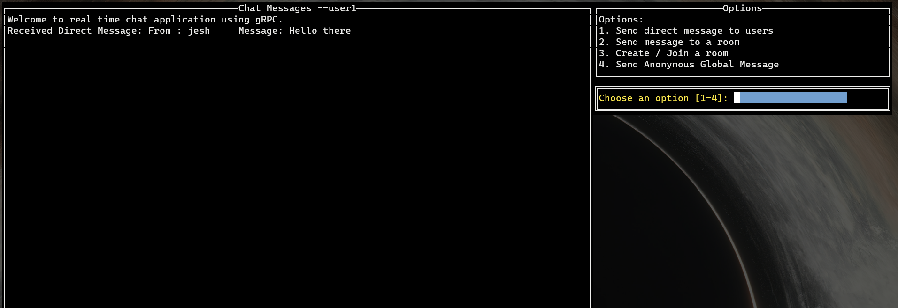

# GRPC-based Real-Time Chat Application

## Overview

This innovative GRPC-based chat application is a cutting-edge solution for real-time communication. It leverages the power of GRPC bi-directional streaming, providing a seamless and interactive chat experience. Designed to handle multiple connections simultaneously, this application stands out for its efficiency and responsiveness in a multi-user environment.



## Key Features

### Robust and Scalable Architecture

- Utilizes GRPC for efficient network communication and low-latency data transfer.
- Supports multiple clients concurrently, ensuring a scalable chat environment.

### Versatile Chat Options

- Direct messaging allows users to send private messages to specific users.
- Group messaging functionality to communicate within created rooms.
- Anonymous messaging feature enables broadcasting messages to all users on the server without revealing identity.

### User-Friendly Interface

- Features a terminal UI based on `tview`, providing an intuitive and accessible user experience.
- Dynamic message handling that caters to various chat scenarios and user interactions.

### State Management

- Implements efficient state management to handle different user actions and inputs.
- Seamless transition between different chat modes like direct messaging, group chats, and anonymous messaging.

### Advanced Message Handling

- Sophisticated message processing that includes receiving, sending, and displaying messages in real-time.
- Customizable input fields and chat display areas for a personalized chat experience.

### Future Enhancements

- Planned integration of SSL security to ensure encrypted and secure communication.
- Continuous optimization of the chat flow for an even smoother user experience.
- Focused efforts on scalability to accommodate an expanding user base.

### Steps to run the project

#### to build the proto

```bash
protoc -I proto --go_out=. --go-grpc_out=. --go_opt=module=github.com/grpc-chat --go-grpcc_opt=module=github.com/grpc-chat proto/*.proto
```

#### Build server and client binaries

```bash
go build -o ./bin/grpc-chat/server ./server/
go build -o ./bin/grpc-chat/client ./client/
```

#### to run the server

```bash
./bin/grpc-chat/server
```

#### to run the client

```bash
./bin/grpc-chat/client
```
